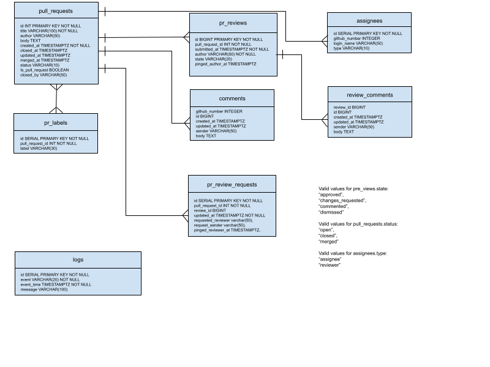

# prestobot

Prestobot is a Probot App for presto.

## Requirements
* Mac OS or Linux
* Node 10+
* Postgresql

## Features

* Provide a welcome message for new contributors clearly explaining contributing guidelines.

Comment a PR with a welcome message for the new contributors. The message is configured in file resources/messages.json, messages   ['welcome-new-contributors'].

* Provide a workflow for developers to kick off tests again.  Example: tag the robot and ask it: “kick off tests”.  This should re-kick off the failed tests.

To rerun failed tests, comment a pull request with “@prestobot kick off tests”. The bot will look for the failed tests and kick off a rerun.

* Read the CODEOWNERS file and tag code owners for review.  Do not allow for merge until a code owner approves.

When a pull request is submitted, the bot will read the CODEOWNERS file in the root directory. If any changes in the PR matches a code owner’s area, that code owner will be added to the reviewer list.

* Automatically tag for review people who have historically modified the files.  Allow for exceptions of people we do not want to tag.

The bot will check the history of the changed files in the last config[“file-history-months”] months and add those who have changed the files to the reviewer list, excluding the accounts in config[“excluded-reviewers”].
config[“file-history-months”] and config[“excluded-reviewers”] are configured in file config/default.json.

* Do a best effort attempt to parse commit message to make sure it adheres to the committer guidelines: https://chris.beams.io/posts/git-commit/

The following template messages are configured in resources/messages.json:
    "commit-number-changed-files-exceeds": "\n- The commit %s has %d changed files, please consider splitting it to multiple commits.",
    "separate-subject-from-body": "- separate subject from body with a blank line.\n",
    "limit-subject-line": "- limit the subject line to 50 characters.\n",
    "capitalize-subject-line": "- capitalize the subject line.\n",
    "subject-no-period": "- do not end the subject line with a period.\n",
    "wrap-commit-message": "- wrap the body at 72 characters",

* Tag a PR based on the files modified.  Examples include connectors, resource management, scheduling, distributed execution, task management, etc.

* Tag a PR based on the files modified.  Examples include connectors, resource management, scheduling, distributed execution, task management, etc.

The bot uses changed file paths to identify the areas changed and tag a PR. Path prefixes are defined in resource/pr_labels.json.
For example, if a changed file path starts with `presto/presto-accumulo/`, this PR will be tagged by `accumulo` and `connector`.

    {
        "path": "presto/presto-accumulo/",
        "labels": ["accumulo", "connector"]
    },

* Metrics Collection

Continuously collect quantiles for PR merge time, PR first review time, PR approval time, review round-trip time (comments to responses to responses to responses, to responses to responses to responses . . .).  P50, mean, P90.  Include breakdown by key tags (see above, tags should indicate if there was a connector, or resource management change, etc.)
Presto bot uses Github events to load related data to Postgre database, please see ER Diagram and Database Access Using psql for details.

* Ping a reviewer to review the code if it’s been stale.  Ideally, this should involve a workflow where once feedback has been given, the bot understands that the author needs to address feedback and push back to the branch before tagging the reviewer (and, if the author is non-responsive, the bot should tag the author to address the feedback).

Presto bot runs the check once a day for stale review requests and change requests. Each time it pings at most 15 reviewers and 15 PR owners if stale more than 7 days, which can be configured in config/default.json:

    "ping-stale-response-days": 7,
    "ping-stale-max-number-prs": 15,

## Deployment

Prestobot is currently deployed on Heroku. Before deployment, you need a paid account, please see https://www.heroku.com/ for details.

### Generate private key and secrets

To deploy Prestobot, you need to create a private key and secrets. An easier way is to run `npx` to generate a temporary project with everything you need.
You will first need a recent version of [Node.js](https://nodejs.org/en/) installed. Open a term and run node -v to verify that it is installed and is at least 10.0.0 or later. `npx` will be installed with node.js.

* Generating a new app

To get started, run
    npx create-probot-app temp-app
This will ask you a series of questions about the app, just use the default values and press ENTER key for all the questions.
    Let's create a Probot app!
    ? App name: temp-app
    ……

* Running the app locally

Go to the app directory just created.
    cd temp-app
    npm start
Now the app is running and listening on port# 3000.

* Configuring the app
    * Start the app if it is not running
    * Visit http://localhost:3000
    * On the page click Register Github app.
    * Give an app name that is not taken already. In our case, it is prestoprobot.
    * After registering your GitHub App, you'll be redirected to install the app on any repositories. At the same time, you can check your local .env and notice it has been populated with all the data you need.

### Installing prestoprobot

Visit the prestoprobot app setting page at [prestoprobot](https://github.com/settings/apps/prestoprobot). Click *Install App* on the left. And then install the app by clicking *Only select repositories*  and select *prestodb/presto*.
If *prestodb/presto* is not listed, try to install new at [Install a New App](https://github.com/apps/prestoprobot/installations/new).

### Config permissions and events

Set permissions [here](https://github.com/settings/apps/prestoprobot/permissions).

* Repository permissions:
    * Actions: Read and write
    * Checks: Read and write
    * Commit statuses: read and write
    * Issues: Read and write
    * Metadata: Read-only
    * Pull requests: Read and write
    * Workflows: Read and write

* Organization permissions:
No access

* Account permissions:
No access

* Subscribe to events:
    * Commit comment
    * Issue Comment
    * Issues
    * Label
    * Pull request
    * Pull request review comment
    * Pull request review thread
    * Push
    * Status
    * Workflow dispatch
    * Workflow jobs
    * Workflow run

### Deploy on Heroku

* Make sure you have the [Heroku CLI](https://devcenter.heroku.com/articles/heroku-cli) installed.

* Clone the app that you want to deploy.
    git clone prestodb/prestobot (github.com)

* Sign up at [Heroku](https://signup.heroku.com/)
    * Account: prestoprobot@gmail.com
    * Team: openteams
    * App: presto-probot
    * Database: postgresql-adjacent-80654

* Login
    $ heroku login

* Create the Heroku app with the heroku create command or create one at [Heroku App](https://dashboard.heroku.com/apps).
    $ heroku apps:create presto-probot

    Creating presto-probot... done, stack is cedar
    http://presto-probot.herokuapp.com/ | git@heroku.com:arcane-lowlands-8408.git
    *Git remote heroku added*

* Go back to your [app settings](https://github.com/settings/apps/prestoprobot) and update the Webhook URL to the URL of your deployment
    e.g. https://presto-probot.herokuapp.com/.

* Configure the Heroku app, replacing the APP_ID, WEBHOOK_SECRET and PRIVATE_KEY with the values for those variables:
    $ heroku config:set -a <<HEROKU_APP_ID>> APP_ID=aaa \
    WEBHOOK_SECRET=bbb \
    PRIVATE_KEY=ccc
Or config the variables at [Config Var](https://dashboard.heroku.com/apps/presto-probot/settings).

* Attach Postgresql
Database plans can be found at [Heroku-Postgresql](https://elements.heroku.com/addons/heroku-postgresql).
    $ heroku addons:create heroku-postgresql:<PLAN_NAME>
Or create and attach a database at [Resources](https://dashboard.heroku.com/apps/presto-probot/resources).

* Set connection string
Database Connection string can be found at [data](https://data.heroku.com). Click the database name then Credentials/default.
    $ heroku config:add DATABASE_URL=<Connection string>

* Deploy the app to heroku with `git push`:

    $ cd prestobot
Set heroku remote if haven't yet
    $ heroku git:remote -a presto-probot
    $ git push heroku main
    ...
    -----> Node.js app detected
    ...
    -----> Launching... done
    http://presto-probot.herokuapp.com deployed to Heroku

Your app should be up and running! To verify that your app
is receiving webhook data, you can tail your app's logs:

    $ heroku config:set LOG_LEVEL=trace
    $ heroku logs --tail
If you get "Everything up-to-date" when running `git push heroku main`, try `git pull` then deploy again.

* Stop prestobot
    $ heroku ps:scale web=0

* Start prestobot
If using a paid account, standard X1, 2 is the number of dynos. You can get it by `heroku ps`.
    $ heroku ps:scale web=2

* Restart
    $ heroku restart

## Database Access Using psql

* Install psql

Follow the instructions [here](https://www.timescale.com/blog/how-to-install-psql-on-mac-ubuntu-debian-windows/) to install Postgresql client.

* Connect to Postgresql

You need database credentials to connect to Postgresql database. It can be found in the [dashboard](https://dashboard.heroku.com/apps), top-right menu -> data -> database name -> credentials
    $ psql -U user-name -d database-name -h host
e.g.:
    psql -U unyvtjwojrthxr -d desors2qptf9o6 -h \
    ec2-54-86-214-124.compute-1.amazonaws.com

* Load functions

The psql functions is located in database/metrics.sql. At the psql prompt `=>`, load the functions using command \i:
    =>\i path-to-metrics.sql

All the functions will be listed:
    average_merge_time()
    average_merge_time_by_label(labelName VARCHAR(30))
    pr_merge_percentile_time(p int)
    pr_merge_percentile_time_by_label(p int, labelName varchar(30))
    average_first_review_time()
    average_first_review_time_by_label(labelName varchar(30))
    pr_first_review_percentile_time(p int)
    pr_first_review_percentile_time_by_label(p int, labelName varchar(30))
    average_approval_time()
    average_approval_time_by_label(labelName varchar(30))
    average_approval_percentile_time(p int)
    average_approval_percentile_time_by_label(p int, labelName varchar(30))
    average_response_time()
    average_response_percentile_time(p int)
    average_response_time_by_label(labelName VARCHAR(30))
    average_response_percentile_time_by_label(p int, labelName VARCHAR(30))

Run the functions using select statement at the psql prompt, run a query:
    =>select pr_merge_percentile_time_by_label(50, 'bug');

    pr_merge_percentile_time_by_label 
    -----------------------------------
    27 days 05:53:06
    (1 row)

* Database ER Diagram

## Interact with Prestobot

* Rerun failed tests

Comment a PR with "@prestobot kick off tests" will rerun the failed tests.

* Load issue and pull request data to database

Connect to Perstobot database and insert a row into tasks table:
`insert into tasks (task, param, status) values('preload', '{"start_num": <start_num>, "end_num": <end_num, "overwrite": true}', 'open');`
For example, `insert into tasks (task, param, status) values('preload', '{"start_num": 1, "end_num": 19090, "overwrite": true}', 'open');` will start loading data for issues and pull requests from number 1 to number 19090.
